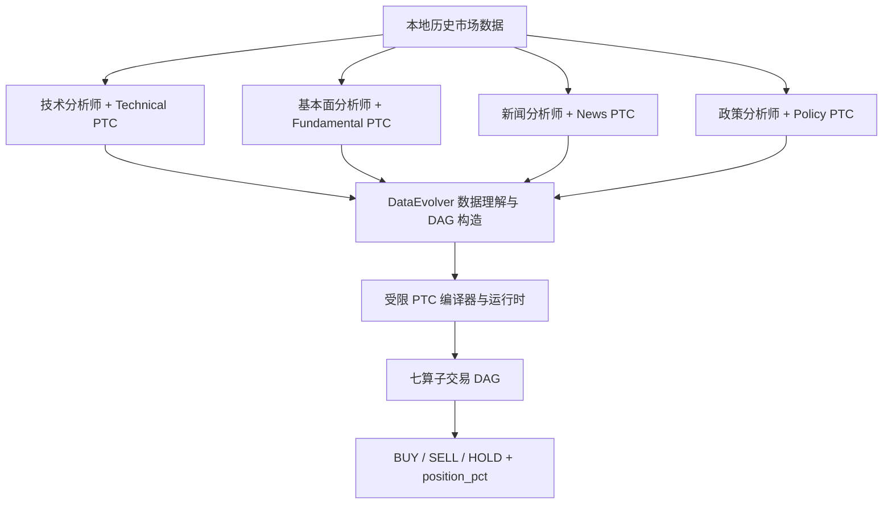
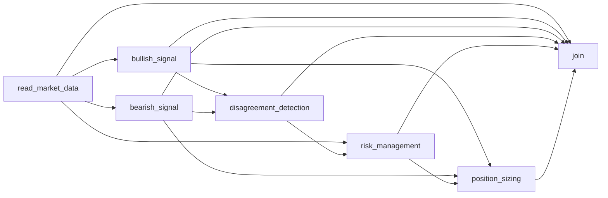

# TradeSys：四分析师 LangGraph + DataEvolver LLM DAG + PTC

本项目是一个面向股票交易研究的多 Agent 系统。系统先由四个 LangGraph 分析师并行整理技术面、基本面、新闻和政策证据，再由 DataEvolver 生成并执行七算子交易 DAG，最终输出 `BUY / SELL / HOLD` 和百分比仓位。

当前代码支持三种执行方式：原始串行 DAG、静态 PTC 并行 DAG、根据市场状态动态选择 Agent 的 PTC DAG。仓库同时保留经过筛选的历史关键 trajectory、运行日志和指标结果，便于老师或其他 Agent 直接审阅。

> 研究边界：项目只使用仓库内的历史市场数据，输出用于实验研究，不构成投资建议。`analysis_results` 中的历史结果来自不同版本，必须结合 [结果索引](analysis_results/RESULTS_INDEX.md) 阅读，不能直接混合比较。

## 1. 当前系统架构



### 1.1 四个 LangGraph 分析师

| 分析师 | 输入 | 单次 PTC 数据收集工具 | 输出 |
| --- | --- | --- | --- |
| 技术分析师 | 行情、技术指标 | `collect_technical_evidence_ptc` | 趋势、波动率、回撤和交易信号 |
| 基本面分析师 | 财报、盈利、资产负债表、现金流 | `collect_fundamental_evidence_ptc` | 基本面立场和证据 |
| 新闻分析师 | 个股和全局新闻 | `collect_news_evidence_ptc` | 新闻情绪、事件和风险 |
| 政策分析师 | 利率、通胀、就业、GDP 等 | `collect_policy_evidence_ptc` | 宏观与政策立场 |

每个分析师在第一次模型回合中被强制调用一次对应 PTC 工具。该工具在一个受控程序中完成多项本地数据读取、筛选和压缩，减少模型反复选择工具造成的往返。

### 1.2 DataEvolver 七算子 DAG

| 算子 | 作用 |
| --- | --- |
| `read_market_data` | 合并四分析师报告，形成统一市场上下文 |
| `bullish_signal` | 提取看涨证据和买入侧论点 |
| `bearish_signal` | 提取看跌证据、退出理由和风险 |
| `disagreement_detection` | 检测多空分支的实质冲突 |
| `risk_management` | 结合波动率、回撤、政策和分歧生成风控建议 |
| `position_sizing` | 综合证据给出仓位建议，不直接生成最终操作 |
| `join` | 汇总全部报告并输出最终操作和百分比仓位 |

静态依赖关系如下：



### 1.3 三种执行模式

| 模式 | 行为 | 主要用途 |
| --- | --- | --- |
| `baseline` | 七个 LLM Agent 按依赖串行执行 | 原始对照组 |
| `static_ptc` | 编译完整七算子 DAG，依赖就绪的多空分支并行执行 | 分离 PTC 并行收益 |
| `dynamic_ptc` | 根据市场状态把不需要的 Agent 替换为经过校验的常量输出 | 动态路由实验 |

动态路由当前有三种策略：

- `risk_off_bearish_focus`：出现卖出信号、波动率不低于 4%，或 60 日回撤不高于 -15% 时，保留看跌分支，跳过看涨与分歧 Agent。
- `clean_bullish_focus`：存在买入信号，且没有风险关闭条件、看跌基本面/新闻和限制性政策时，保留看涨分支，跳过看跌与分歧 Agent。
- `mixed_evidence_dual_branch`：其他情况同时运行多空分支和分歧检测。

PTC 运行时不使用 Python `exec`。它只接受注册的 `tool_call` 和经过 schema 校验的 `constant` 指令，并校验算子、依赖、环、输入输出字段以及最终决策是否存在。

## 2. 环境准备

### 2.1 推荐环境

- Python 3.11 或 3.12
- Windows PowerShell；Linux/macOS 也可以运行，命令换行符需自行调整
- 一个 OpenAI-compatible Chat Completions API

### 2.2 安装

```powershell
git clone https://github.com/Mengseventeen/tradesys.git
cd tradesys
python -m venv .venv
.\.venv\Scripts\Activate.ps1
python -m pip install --upgrade pip
pip install -r requirements.txt
```

如果 PowerShell 禁止激活脚本，可以直接使用 `.venv\Scripts\python.exe` 运行后续命令。

### 2.3 配置模型

复制 `.env.example` 为 `.env`，然后填写真实密钥。不要将 `.env` 提交到 Git：

```powershell
Copy-Item .env.example .env
```

```dotenv
OPENAI_API_KEY=your_api_key
OPENAI_BASE_URL=https://api.openai.com/v1
OPENAI_MODEL=gpt-4o-mini
OPENAI_TIMEOUT=360
OPENAI_MAX_RETRIES=2
```

其中只有 `OPENAI_API_KEY` 必填。也可以直接设置系统环境变量。

先执行 dry run 检查参数和数据日期，不调用模型：

```powershell
python run_analysis.py --ticker AMZN --date 2023-04-10 --execution-mode dynamic_ptc --dry-run
```

## 3. 如何运行项目

### 3.1 单股票单日

```powershell
python run_analysis.py `
  --ticker AMZN `
  --date 2023-04-10 `
  --execution-mode dynamic_ptc `
  --results-dir analysis_results\single_dynamic_case
```

### 3.2 单股票日期区间

```powershell
python run_analysis.py `
  --ticker AMZN `
  --start-date 2022-10-06 `
  --end-date 2023-04-10 `
  --workers 8 `
  --batch-size 8 `
  --execution-mode static_ptc `
  --results-dir analysis_results\amzn_static_ptc
```

### 3.3 四股票全量区间

```powershell
python run_analysis.py `
  --tickers AMZN MSFT NFLX TSLA `
  --start-date 2022-10-06 `
  --end-date 2023-04-10 `
  --workers 8 `
  --batch-size 8 `
  --execution-mode dynamic_ptc `
  --results-dir analysis_results\dynamic_ptc_full
```

`--workers` 是同一实验内同时分析的股票-日期任务数。过高并发可能触发 API 限流；建议先从 4 或 8 开始，再根据 API 配额提高。`--batch-size` 控制每完成多少个任务写一次 checkpoint。

### 3.4 当前三组消融

```powershell
python run_ptc_ablation.py `
  --tickers AMZN MSFT NFLX TSLA `
  --start-date 2022-10-06 `
  --end-date 2023-04-10 `
  --workers 8 `
  --results-dir analysis_results\ptc_ablation_full
```

该脚本依次运行 `baseline`、`static_ptc`、`dynamic_ptc`，并在每组完成后自动计算 next-day-open 指标，生成：

- `ablation_summary.csv`
- `ablation_summary.json`
- 每个模式自己的 `decisions.csv`、trajectory、日志和回测目录

也可以只运行指定模式：

```powershell
python run_ptc_ablation.py --modes static_ptc dynamic_ptc --tickers AMZN --start-date 2023-04-03 --end-date 2023-04-10
```

> 本次仓库整理没有启动新的全量实验。仓库中的 PTC 对照数据是一个单日 smoke test，只证明执行链路可用和记录了当次延迟，不能用于判断交易性能。

## 4. 如何计算最终 Metric

### 4.1 从已有 decisions.csv 回放

推荐使用“信号日生成决策、下一交易日开盘执行”的口径：

```powershell
python evaluate_position_pct_replay.py `
  --decisions analysis_results\dynamic_ptc_full\decisions.csv `
  --execution next_day_open `
  --final-liquidation `
  --output-dir analysis_results\dynamic_ptc_full\performance_next_day_open
```

这一步不调用 LLM，因此已有 `decisions.csv` 时可以反复重算。默认设置为：

- 初始资金：100,000
- 年化无风险利率：3%
- 每年折算天数：252
- 每股手续费：0.0049
- 最低手续费：0.99
- 手续费上限：成交额的 1%
- `--final-liquidation`：回测最后一天平掉剩余持仓

如需当天收盘执行的敏感性检查：

```powershell
python evaluate_position_pct_replay.py `
  --decisions path\to\decisions.csv `
  --execution same_day_close `
  --final-liquidation `
  --output-dir path\to\performance_same_day_close
```

论文主表必须统一执行口径，不能把 `same_day_close` 和 `next_day_open` 放在同一列直接比较。

### 4.2 指标定义

设第 `t` 日组合净值为 `V_t`，日收益为 `r_t = V_t / V_(t-1) - 1`，初始资金为 `V_0`。

| 字段 | 含义 | 当前实现 |
| --- | --- | --- |
| `SPR` | 年化 Sharpe ratio | `(mean(r) - 0.03/252) / sample_std(r) * sqrt(252)` |
| `CR` | 累计收益率，单位 % | `(final_value / initial_cash - 1) * 100` |
| `MDD` | 最大回撤，单位 % | `min(V_t / running_peak_t - 1) * 100` |
| `AV` | 年化波动率，单位 % | `sample_std(r) * sqrt(252) * 100` |

`Average` 行是四只股票各指标的算术平均，不是把四只股票合成一个等权投资组合后重新计算。

当前价格加载器会用最近一个交易日价格补齐周末/节假日，再对该日历序列计算收益；非交易日收益因此通常为 0。由于年化仍使用 252，这一口径应在论文中明确，并在所有方法中保持一致。

### 4.3 Buy-and-hold 基线

```powershell
python evaluate_buy_and_hold.py `
  --tickers AMZN MSFT NFLX TSLA `
  --date-from 2022-10-06 `
  --date-to 2023-04-11 `
  --output-dir analysis_results\buy_and_hold
```

`--date-to` 是右开区间。如果希望覆盖到 2023-04-10，应传入下一天 2023-04-11。

## 5. 输出文件说明

一次标准运行目录通常如下：

```text
analysis_results/<run_name>/
├── decisions.csv
├── decision_results_compact.csv
├── all_results.json
├── <TICKER>_results.json 或 multi_ticker_results.json
├── debug_runs/
│   └── <TICKER>_<DATE>_debug.json
├── reports/
│   └── 四分析师的 Markdown 报告
├── stdout.log / stderr.log
└── performance_next_day_open/
    ├── position_pct_metrics.csv
    ├── position_pct_summary.json
    ├── position_pct_daily_equity.csv
    └── position_pct_trades.csv
```

| 文件 | 用途 | 是否建议提交 Git |
| --- | --- | --- |
| `decisions.csv` | 每个 ticker/date 的状态、操作、仓位和 trajectory 路径 | 正式结果建议提交 |
| `decision_results_compact.csv` | 精简的操作结果，便于快速查看 | 建议提交 |
| `all_results.json` | 全量嵌套结果，体积很大且常与分股票文件重复 | 通常不提交 |
| `debug_runs/*.json` | 完整 trajectory：报告、消息、DAG、节点输出、路由、最终决策 | 每个关键 case 选少量提交 |
| `reports/*.md` | 每个分析师的文本报告 | 一般不全量提交，内容已在 trajectory 中 |
| `stdout.log` | 命令配置、进度、成功/失败和保存路径 | 关键运行建议提交 |
| `stderr.log` | 警告和异常 | 有实际错误时提交 |
| `position_pct_metrics.csv` | 每只股票及 Average 的最终指标表 | 必须提交 |
| `position_pct_summary.json` | 回测参数、日期和汇总元数据 | 必须提交 |
| `position_pct_daily_equity.csv` | 每日净值、现金、持仓、收益和回撤 | 正式结果建议提交 |
| `position_pct_trades.csv` | 实际成交、数量、价格和手续费 | 正式结果建议提交 |
| `ablation_summary.csv/json` | 三种执行模式的指标、耗时、调用数和路由频次 | 完整消融后必须提交 |

### trajectory 中重点查看什么

`debug_runs/*.json` 的关键字段：

- `reports`：四分析师最终报告；
- `messages`：模型与 PTC 工具的消息轨迹；
- `workflow.workflow_plan`：DataEvolver 生成和校验后的 DAG；
- `workflow.workflow_outputs.dag_execution`：节点输出、执行顺序/并行层、PTC 程序、call trace 和动态策略；
- `workflow.final_decision`：结构化交易决定；
- `local_evidence`：从本地数据提取的证据；
- `error`：失败时的异常信息。

## 6. 项目文件结构

| 路径 | 作用 |
| --- | --- |
| `run_analysis.py` | 单日、批量、多股票入口；配置模型、并发和结果保存 |
| `run_ptc_ablation.py` | 运行 baseline/static/dynamic 三组实验并汇总指标 |
| `evaluate_position_pct_replay.py` | 按 `position_pct` 回放交易并计算最终指标 |
| `evaluate_buy_and_hold.py` | 计算 buy-and-hold 对照指标 |
| `tradesys/graph/setup.py` | 构建四分析师并行 LangGraph，并连接 DataEvolver |
| `tradesys/graph/conditional_logic.py` | 控制 analyst → tool → analyst 的工具调用循环 |
| `tradesys/agents/analyst/` | 技术、基本面、新闻、政策四个分析师 |
| `tradesys/agents/utils/ptc_data_tools.py` | 四个单次 PTC 数据收集程序 |
| `tradesys/dataflows/` | 读取本地行情、指标、财报、新闻和宏观数据 |
| `tradesys/workflows/dataevolver.py` | DataEvolver 数据理解、搜索、DAG 校验和执行入口 |
| `tradesys/workflows/trading_operators.py` | 七类交易算子的注册、输入输出 schema 和实现 |
| `tradesys/workflows/llm_trading_agents.py` | 交易算子的 LLM Agent 执行与质量评估/修订 |
| `tradesys/workflows/ptc_runtime.py` | 静态/动态 PTC 编译、校验、并行调度和路由 |
| `tradesys/evaluation/common.py` | 评估公共常量、价格加载、手续费和指标函数 |
| `tradesys/data_portfolio/` | 四只股票、新闻和宏观经济的本地历史数据 |
| `tests/test_ptc_runtime.py` | PTC 并行层、动态路由和受限指令校验测试 |
| `analysis_results/RESULTS_INDEX.md` | 已提交历史案例、结论边界和 trajectory 导航 |
| `docs/ITERATION_HISTORY.md` | 从旧方法到当前动态 PTC 的关键迭代记录 |
| `docs/PTC_OPTIMIZATION_REPORT.md` | PTC 设计、实现与单样本验证报告 |

## 7. 已保留的关键历史案例

仓库只保留对审阅有帮助的代表样例，详细路径与适用范围见 [analysis_results/RESULTS_INDEX.md](analysis_results/RESULTS_INDEX.md)：

- 旧 LLMCompiler 完整 Agent 系统的一条轨迹；
- DataEvolver signal-only 的 BUY、SELL、HOLD 三条轨迹和完整指标；
- 人工优化固定规则 DAG 的 BUY、SELL、HOLD 三条轨迹和完整指标；
- 当前完整七 Agent DAG 的 baseline、static PTC、dynamic PTC 三条同日轨迹及运行日志。

未提交的内容包括重复的数百条逐日 trajectory、与分股票结果完全重复的 `all_results.json`、空 stderr、PID 文件以及多次修复产生的重复日志。它们不增加方法可审计性，只会显著放大仓库。

## 8. 测试与故障排查

运行单元测试：

```powershell
python -m unittest discover -s tests -v
```

进行语法编译检查：

```powershell
python -m compileall -q run_analysis.py run_ptc_ablation.py tradesys tests
```

常见问题：

- `OPENAI_API_KEY` 未设置：确认 `.env` 位于项目根目录且变量名正确；
- 429/限流：降低 `--workers`，增加 API 重试次数；
- 日期没有数据：先用 `--dry-run`，确认日期位于本地数据范围；
- 单日回测的指标为空：单个交易日不足以形成可解释的收益序列，这是正常现象；
- 运行中断：批处理会持续写入 `decisions.csv` 和 debug trajectory，可从已有结果判断完成范围，但当前入口不会自动跳过已完成日期；
- 不要把 `.env`、API Key 或未筛选的完整输出目录提交到 Git。

## 9. 当前限制与后续实验

- 当前已提交的 PTC 对照只有 AMZN 2023-04-10 一个样本，只能说明流程可执行；
- LLM 输出存在随机性，正式消融应固定模型配置并考虑多次重复；
- 动态路由目前使用显式市场状态规则，不是端到端学习的 router；
- 手动 `bull_only / bear_only / dual_no_disagreement` DAG profile 尚未实现；
- 正式论文结果应在相同 ticker、日期、执行价格、手续费、仓位上比较，并同时报告收益指标、耗时、工具调用数、跳过 Agent 数和路由频率。

建议下一阶段在不改变评估口径的情况下增加手动 DAG profiles，再运行完整的静态、手动和动态结构消融。
