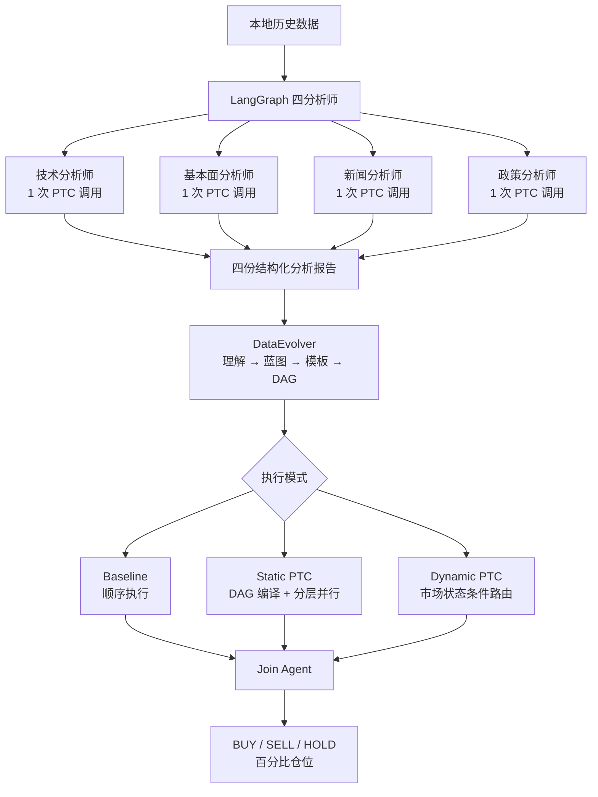
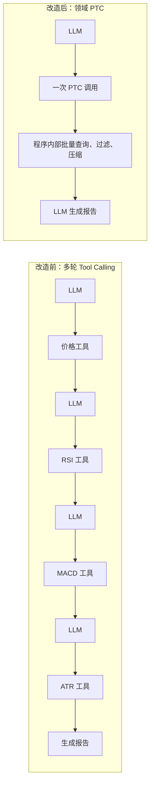
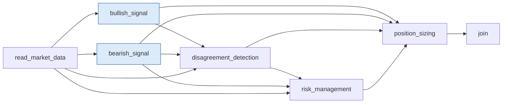
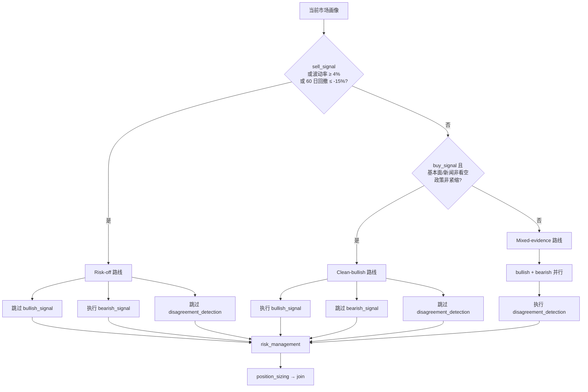
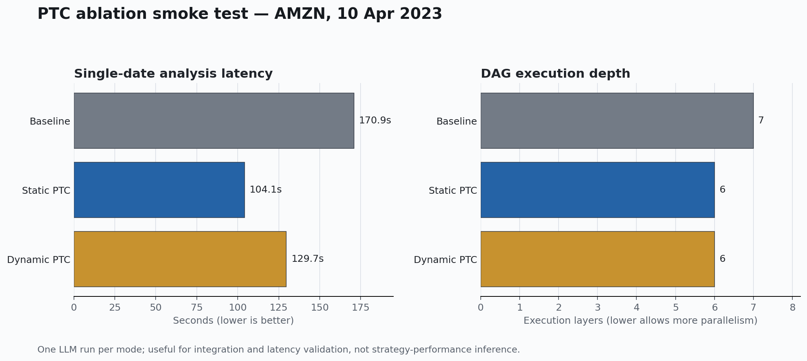

# TradeSys 多智能体交易系统 PTC 改进与优化报告

## 技术摘要

本次改造将 TradeSys 从“多轮工具查询 + 顺序执行七算子 DAG”升级为“领域级程序化数据收集 + 可验证 PTC 程序 + 条件化多智能体路由”。改造没有改变最终交易决策契约，系统仍输出 `BUY / SELL / HOLD` 和百分比仓位，但重新设计了数据收集、DAG 执行与实验评估方式。

主要结果如下：

- 四个 LangGraph 分析师现在各自只调用一次领域 PTC 工具。真实运行轨迹显示，技术、基本面、新闻和政策分析师均为 3 条消息、1 次工具调用。
- DataEvolver 可以在 `baseline`、`static_ptc` 和 `dynamic_ptc` 三种模式之间切换，为后续消融实验提供统一接口。
- Static PTC 将完整七算子 DAG 编译为受限程序，并把 `bullish_signal` 与 `bearish_signal` 放在同一并行层，执行深度由 7 层降至 6 层。
- 单日真实 LLM 冒烟实验中，Static PTC 耗时由 Baseline 的 170.9 秒降至 104.1 秒，下降约 39.1%。Dynamic PTC 耗时为 129.7 秒，下降约 24.1%。这些数据仅验证集成与延迟，不构成策略收益结论。
- 动态模式可以根据技术信号、波动率、回撤、基本面、新闻和政策状态，安全跳过看多、看空或分歧检测 Agent。
- PTC 运行时不使用 Python `exec`，只执行白名单 `tool_call` 和 `constant` 指令，并检查依赖、算子、输出和冲突。

当前证据足以说明 PTC 改造在架构、并行度和可审计性方面有效，但还不能说明其能提高交易收益。金融效果需要在相同股票、日期、模型和成交假设下完成全量三组消融后再判断。

## 改进后的系统形成两层多智能体结构

改造后的主链路仍然保留 LangGraph 四分析师与 DataEvolver 七算子 Agent，但在两层之间加入程序化数据收集和受限程序执行。



这一结构的关键变化不是增加更多 Agent，而是让程序承担确定性的控制流，让 LLM 集中处理需要语义判断的部分。

## 四分析师的数据收集由多轮查询收敛为一次程序调用

### 原始方式的问题

原始分析师可以自主选择多个细粒度工具。例如技术分析师可能依次查询价格、RSI、MACD 和 ATR。每次工具调用都需要经历“模型决定调用—执行工具—结果回填—模型再次推理”的循环，存在三个问题：

1. 工具往返次数不稳定，不同日期可能产生不同调用长度。
2. 原始数据重复进入上下文，增加 token 消耗并稀释重要证据。
3. 分析师可能遗漏应查询的数据，降低不同实验之间的可比性。

### PTC 数据程序

新增的领域工具位于 [`ptc_data_tools.py`](../tradesys/agents/utils/ptc_data_tools.py)：

| 分析师 | PTC 工具 | 程序内部操作 |
| --- | --- | --- |
| 技术 | `collect_technical_evidence_ptc` | 读取 120 日价格；批量读取 RSI、随机指标、MACD、ATR；返回紧凑轨迹 |
| 基本面 | `collect_fundamental_evidence_ptc` | 合并财务报表摘要、近期盈利和最近一份 filing |
| 新闻 | `collect_news_evidence_ptc` | 读取过去 7 天新闻；按标题去重；保留最多 15 条紧凑记录 |
| 政策 | `collect_policy_evidence_ptc` | 合并宏观快照与利率、收益率、通胀、就业、情绪历史 |



分析师第一次调用被 `tool_choice` 强制指定为领域 PTC 工具；收到结果后再生成最终报告。真实 debug 轨迹验证四个分析师都只产生了一次工具调用。

## Static PTC 将声明式 DAG 编译为可并行的受限程序

### 编译目标

DataEvolver 仍然负责生成七算子 DAG，Static PTC 不改变算子集合，只改变执行表达和调度方式。因此它是最干净的架构消融：Baseline 与 Static PTC 使用相同分析阶段、相同算子和相同提示词，主要差异是顺序执行与程序化分层执行。

编译器和运行时位于 [`ptc_runtime.py`](../tradesys/workflows/ptc_runtime.py)。编译后的可读程序如下：

```python
market_context = call_tool("read_market_data", raw_evidence, data_profile)

# 同一依赖层并行执行
bullish_view = call_tool("bullish_signal", market_context)
bearish_view = call_tool("bearish_signal", market_context)

disagreement_report = call_tool(
    "disagreement_detection",
    bullish_view,
    bearish_view,
    market_context,
)

risk_profile = call_tool(
    "risk_management",
    market_context,
    bearish_view,
    disagreement_report,
)

trade_instruction = call_tool(
    "position_sizing",
    bullish_view,
    bearish_view,
    risk_profile,
    disagreement_report,
)

final_decision = call_tool("join", trade_instruction)
```



蓝色节点位于同一执行层。运行时使用依赖就绪调度：只有当所有上游节点完成时，节点才会进入 ready 集合；同层节点使用线程池并行。

### 受限程序的安全边界

PTC 程序不是任意 Python 代码。当前 IR 只允许：

- `tool_call`：调用注册表中的交易算子；
- `constant`：为动态跳过的 Agent 提供经过 Schema 检查的安全输出。

运行前必须通过以下校验：

- 程序版本必须为 `ptc-ir-v1`；
- 指令 ID 唯一；
- 算子必须存在于白名单；
- 所有依赖必须存在且无环；
- 输入字段必须已经由上游产生；
- 常量输出必须包含对应算子的输出键；
- 最终必须产生 `final_decision`；
- 不允许覆盖已经存在的输出字段。

单元测试确认，伪造的 `python_exec` 指令会被明确拒绝。这使 PTC 具备程序控制流的优势，同时避免模型获得文件、网络、进程和任意代码执行权限。

## Dynamic PTC 让市场状态决定实际参与的 Agent

Static PTC 仍然执行全部七个算子。Dynamic PTC 在编译阶段读取 `data_profile`，根据以下信号选择 Agent 路线：

- 技术买入和卖出信号；
- ATR/价格波动率；
- 60 日回撤；
- 基本面倾向；
- 新闻倾向；
- 政策是否紧缩。



跳过节点不会简单删除字段，而是由 `constant` 指令生成保守、低置信度且带 `ptc_skipped=true` 的结构化观点。例如 Risk-off 路线会把看多观点替换为“无可执行看多逻辑，优先进行风险分析”。因此下游风险和仓位 Agent 仍然获得完整输入契约。

这种实现让“动态团队”有了可观测定义：不同日期可以产生不同工具调用集合、不同跳过数量和不同 routing strategy，而不只是生成不同的自然语言计划。

## 单日消融显示并行执行降低了延迟

下图比较相同股票和日期下三种模式的实际耗时和执行层数。样本为 AMZN、2023 年 4 月 10 日，每种模式只运行一次。



Static PTC 的主要变化是把看多和看空 Agent 并行，因此执行层数从 7 降至 6，耗时从 170.9 秒降至 104.1 秒。Dynamic PTC 耗时为 129.7 秒；该样本被路由到 `mixed_evidence_dual_branch`，仍然执行全部七个算子，所以没有观察到节点跳过带来的额外节省。

| 模式 | 分析耗时 | 相对 Baseline | LLM 算子调用 | 跳过调用 | 执行层 | 单日决策 |
| --- | ---: | ---: | ---: | ---: | ---: | --- |
| Baseline | 170.9 秒 | 基准 | 7 | 0 | 7 | HOLD |
| Static PTC | 104.1 秒 | -39.1% | 7 | 0 | 6 | BUY 50% |
| Dynamic PTC | 129.7 秒 | -24.1% | 7 | 0 | 6 | HOLD |

不同模式产生了不同交易决策，这说明当前 LLM 输出仍存在随机性。单次结果不能用于判断哪种架构具有更高收益，也不能把耗时差异完全归因于 PTC；接口负载、模型响应长度和重试次数也会影响结果。该实验的作用是证明三种模式都能完成真实调用、生成合法决策、输出执行轨迹并进入统一回放流程。

## 三组消融实验已经具备统一、可复现的运行入口

新增 [`run_ptc_ablation.py`](../run_ptc_ablation.py)，按相同输入依次运行：

1. `baseline`：七算子顺序执行；
2. `static_ptc`：相同七算子编译为 PTC 并分层并行；
3. `dynamic_ptc`：PTC 并行，同时根据市场状态跳过部分 Agent。

完整运行命令：

```powershell
python run_ptc_ablation.py `
  --tickers AMZN MSFT NFLX TSLA `
  --start-date 2022-10-06 `
  --end-date 2023-04-10 `
  --workers 8 `
  --batch-size 8 `
  --results-dir analysis_results\ptc_ablation_full
```

每组实验都会使用下一交易日开盘成交和最终清仓进行回放，并在根目录输出：

- `ablation_summary.json`；
- `ablation_summary.csv`；
- 各模式的决策文件、完整 debug 轨迹和回放指标。

汇总指标包括：

| 指标类别 | 指标 |
| --- | --- |
| 金融表现 | SPR、累计收益 CR、最大回撤 MDD、年化波动 AV |
| 决策质量 | 成功数、错误数、BUY/SELL/HOLD 分布 |
| 系统效率 | 分析耗时、评估耗时、平均工具调用、平均跳过调用、平均执行层数 |
| 动态性 | 各 routing strategy 出现频率 |

## 当前限制决定了哪些结论还不能下

### 单样本不能证明交易性能提升

现有三模式结果只有一个股票日。SPR、CR、MDD 和 AV 在单日窗口下没有解释价值，因此报告不对收益优劣作结论。完整消融至少需要覆盖四只股票的全部 508 个股票日，并使用完全相同的回放参数。

### LLM 随机性会污染架构对比

三种模式目前分别重新调用四分析师和 DataEvolver Planner。即使输入相同，不同调用也可能生成不同报告、计划和最终决策。因此全量实验应记录模型、温度、提示词版本和每个节点输出；如果接口支持确定性 seed，应固定 seed。更严格的架构对比可以先缓存四分析师报告和 DataEvolver 计划，再让三种执行器消费完全相同的中间输入。

### Dynamic PTC 阈值目前是工程初值

`4%` 波动率和 `-15%` 回撤阈值来自当前规则体系，不是经过独立训练集优化的结果。后续应在训练窗口选择阈值，在验证窗口确定版本，最后冻结后进入测试窗口，避免用测试收益反复调整路由。

### PTC 减少工具往返，但尚未记录 token

当前系统已经记录调用数、跳过数和执行层数，但没有记录每次 LLM 请求的输入与输出 token。延迟下降不等同于成本下降。完整实验应增加模型 usage 元数据，并比较每个股票日的总 token、重试次数和 API 调用数。

### 动态模式仍基于固定七算子能力库

Dynamic PTC 可以跳过现有算子，但尚不能从多个同类 Agent 中选择。例如系统还没有 `trend_following_signal`、`mean_reversion_signal`、`volatility_guard` 等可替代算子。当前动态性属于“条件裁剪”，下一阶段才是“条件选型”。

## 推荐的下一轮优化应优先提升实验可信度

### 1. 缓存公共上游，隔离执行器变量

建议将消融拆成两阶段：

```text
阶段 A：一次生成四分析师报告和 DataEvolver 计划
阶段 B：Baseline / Static PTC / Dynamic PTC 复用相同输入
```

这样可以把差异更准确地归因于执行器，而不是上游 LLM 随机波动。

### 2. 增加 token、重试和节点耗时统计

每个 Agent 轨迹建议增加：

- prompt tokens；
- completion tokens；
- 首次成功率；
- 重试次数；
- 节点 wall-clock latency；
- evaluator latency；
- 缓存命中率。

这些指标可以回答 PTC 是否真正降低成本，而不仅是减少总时长。

### 3. 将动态路由扩展为算子选择

建议新增可替代算子：

- 趋势环境：`trend_following_signal`；
- 震荡环境：`mean_reversion_signal`；
- 深度回撤：`drawdown_repair_signal`；
- 高波动：`volatility_guard`；
- 高分歧：`independent_verifier`。

届时 PTC 程序不仅能跳过 Agent，还能根据 regime 选择不同专家，形成真正的动态团队。

### 4. 使用 Walk-forward 而不是在同一窗口调参

推荐最小实验划分：

```text
训练/路由阈值选择：2022-10 至 2022-12
验证/版本选择：    2023-01 至 2023-02
最终冻结测试：      2023-03 至 2023-04
```

如果后续扩充多年数据，应改为滚动窗口，每次只使用过去数据选择程序和阈值。

### 5. 控制并发并加入接口退避

PTC 减少单任务内部串行等待后，全量实验更适合中等并发，而不是盲目扩大 worker。建议记录 4、8、16 路并发下的吞吐、错误和 P95 延迟，选择不触发接口限流的拐点；对 HTTP 429、超时和临时网络错误增加指数退避。

## 后续需要回答的问题

1. Static PTC 的延迟优势在 508 个股票日上是否稳定，还是只出现在部分日期？
2. Dynamic PTC 平均能跳过多少个 Agent，节省多少 token 和时间？
3. Risk-off、Clean-bullish 和 Mixed-evidence 三种路线的金融表现是否存在显著差异？
4. 动态跳过分支是否降低了决策质量，特别是是否会错过反向风险？
5. 在复用相同上游报告和相同 DAG 计划后，三种执行器的决策差异是否仍然存在？
6. 新增专用 regime Agent 后，动态选型是否优于当前条件裁剪？

在回答这些问题之前，最稳妥的结论是：PTC 改造已经证明能够减少分析师工具往返、把多空分支并行化、提供安全的条件路由和完整审计轨迹；其交易收益价值仍需通过冻结配置后的全量消融实验验证。
